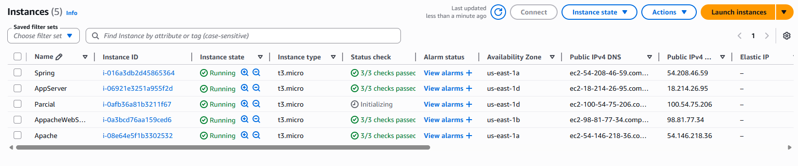
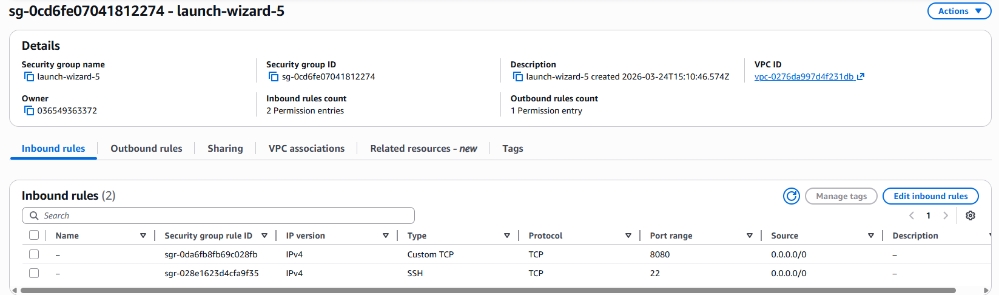
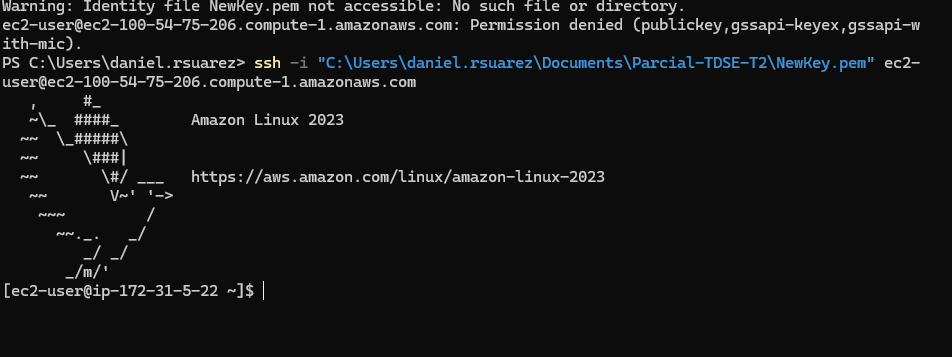
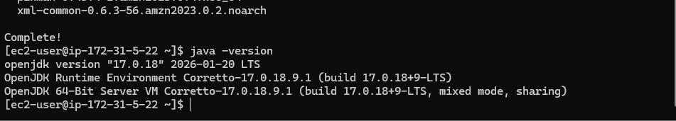
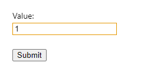
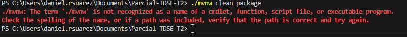
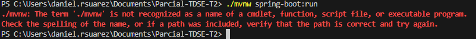

# Parcial-TDSE-T2

Daniel Esteban Rodriguez Suarez

---

First we configure the environment for the exercise
in this case we have the example of the .html

        <!DOCTYPE html>
        <html>
        <head>
        <title>Form Example</title>
        <meta charset="UTF-8">
        <meta name="viewport" content="width=device-width, initial-scale=1.0">
        </head>
        <body>
        <h1>Form with GET</h1>
        <form action="/Catalan">
        <label for="value">Value:</label> 
        <input type="text" id="value" name="value" value="1">  
        <input type="button" value="Submit" onclick="loadGetMsg()">
        </form>
        

        
        </body>
        </html>

We have in this html the option of entering one value and returning the list of the output. Like in the expample of the problem of this part of the exam.

There are also some class that don need to be changed, like:

    package co.edu.eci;

        public record Greeting(long id, String content) { }

    package co.edu.eci;

    import org.springframework.boot.SpringApplication;
    import org.springframework.boot.autoconfigure.SpringBootApplication;

    @SpringBootApplication
    public class RestServiceApplication {

    public static void main(String[] args) {
    SpringApplication.run(RestServiceApplication.class, args);
    }

    }

Finally we have a last class that don hve to much changes but those changes are neccesary for the develop of this problem.

    package co.edu.eci.lambda.springrest;

    import java.util.concurrent.atomic.AtomicLong;

    import org.springframework.web.bind.annotation.GetMapping;
    import org.springframework.web.bind.annotation.RequestParam;
    import org.springframework.web.bind.annotation.RestController;

    @RestController
    public class GreetingController {

    private static final String template = "Hello, %s!";
    private final AtomicLong counter = new AtomicLong();

    @GetMapping("/Catalan")
    public Greeting greeting(@RequestParam String name) {
    return new Greeting(counter.incrementAndGet(), String.format(template, name));
    }
    }

Those changes in some cases could be minimal but refers to the develop of the problem.

---

To resolve the problem of Catalan, we need no manage to type of values.

The first one is a bigdecimal value wich refers to the letter n.

Then we have a list for the output, this one depends for each value of n.

For example, if n = 1 the out put would be 1,1. This because the algorithm calculate n=0 and n=1. 

Note: We already have n = 0 as a base case and as we already saw in the example the output is 1.

---

Also we need to prepare de AWS environment for a future implementation.

we crerate a new instance for this exam called Parcial.

We edit the secure groups and include the port 8080.

We stablish connection to the aws server.

We install java and then we verify the instalation

---

here we have an example of the view in the web introducing the value and then click in submit for getting the output.

---

Some Troubles

    <?xml version="1.0" encoding="UTF-8"?>
    <project xmlns="http://maven.apache.org/POM/4.0.0" xmlns:xsi="http://www.w3.org/2001/XMLSchema-instance"
    xsi:schemaLocation="http://maven.apache.org/POM/4.0.0 https://maven.apache.org/xsd/maven-4.0.0.xsd">
    <modelVersion>4.0.0</modelVersion>
    <parent>
    <groupId>org.springframework.boot</groupId>
    <artifactId>spring-boot-starter-parent</artifactId>
    <version>3.3.0</version>
    <relativePath/> <!-- lookup parent from repository -->
    </parent>
    <groupId>com.example</groupId>
    <artifactId>rest-service-complete</artifactId>
    <version>0.0.1-SNAPSHOT</version>
    <name>rest-service-complete</name>
    <description>Demo project for Spring Boot</description>
    <properties>
    <java.version>17</java.version>
    </properties>
    <dependencies>
    <dependency>
    <groupId>org.springframework.boot</groupId>
    <artifactId>spring-boot-starter-web</artifactId>
    </dependency>

    <dependency>
    <groupId>org.springframework.boot</groupId>
    <artifactId>spring-boot-starter-test</artifactId>
    <scope>test</scope>
    </dependency>
    </dependencies>

    <build>
    <plugins>
    <plugin>
    <groupId>org.springframework.boot</groupId>
    <artifactId>spring-boot-maven-plugin</artifactId>
    </plugin>
    </plugins>
    </build>

    </project>

For some reasone this pom.xml appear to be not being reading, so this cause some problems at the inizialization

This problem could be because there are missing dependencies or plugins or could be both.

